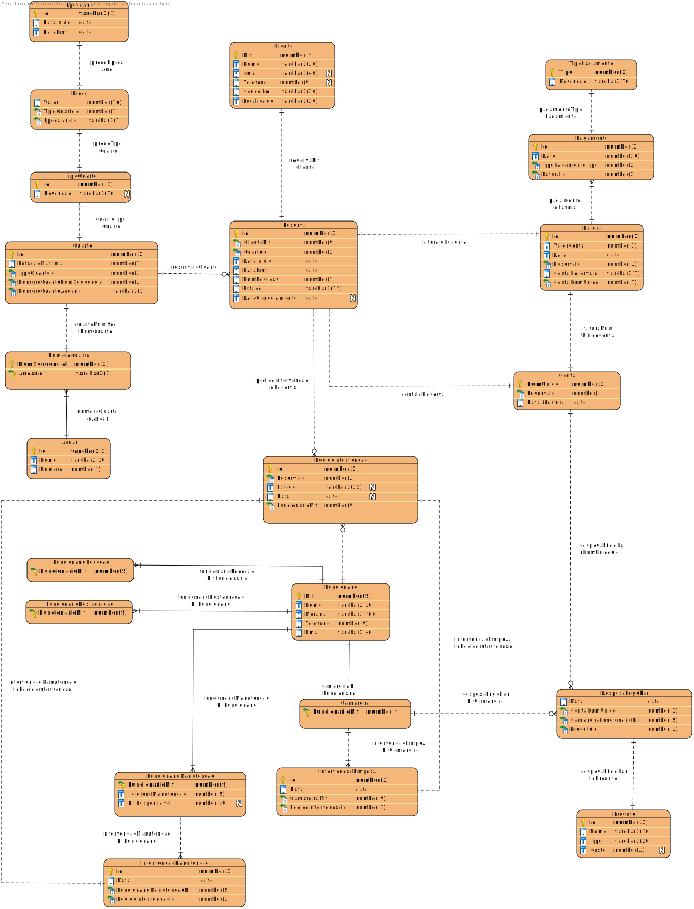

# Relatório de Bases de Dados 2020/2021
## Parte I

## Docente
- Ângelo Manuel Martins AMM

## Grupo
- Bernardo Carvalho 1170691
- Paulo Moreira 1180778
- Tiago Ribeiro 1181444

<div style="page-break-after: always;"></div>

# Modelo Relacional



<div style="page-break-after: always;"></div>

# Consultas

## Parte I

### **(a)** Apresentar todos os pedidos de intervenção em aberto (intervenção ainda não registada) alocados a funcionários de manutenção que não fizeram nenhuma intervenção (registo) nas últimas 48 horas.

```sql
SELECT *
FROM PEDIDOINTERVENCAO pi
WHERE pi.FUNCIONARIONIF IN (SELECT FUNCIONARIOMANUTENCAONIF
                            FROM INTERVENCAOMANUTENCAO im
                            WHERE pi.FUNCIONARIONIF = im.         FUNCIONARIOMANUTENCAONIF
                              AND im.DATA > SYSDATE - 2)
  AND pi.ESTADO = 'em aberto'
ORDER BY pi.ID;
```

**RESULTADO DA CONSULTA:**

| ID   | RESERVAID | ESTADO    | DATA                | FUNCIONARIONIF |
| :--- | :-------- | :-------- | :------------------ | :------------- |
| 9    | 10        | em aberto | 2020-11-17 00:00:00 | 283174587      |
| 12   | 13        | em aberto | 2020-11-18 00:00:00 | 283174587      |
|      |           |           |                     |                |

Nesta consulta começamos por selecionar todos os dados da tabela **PedidoIntervencao** onde o NIF do funcionário responsável se encontrasse no resultado da *inner query*  e o estado do pedido de intervenção fosse *em aberto*. A *inner query* procura todos os NIFS dos funcionários que realizaram intervenções de manutenção nas últimas 48h (```SYSDATE - 2```);

<div style="page-break-after: always;"></div>

### **(b)** Apresentar a data, a hora e o nome dos clientes que reservaram quartos somente durante o mês de Abril e Junho deste ano. No caso de algum cliente ter reservado um quarto do tipo suite, deverá apresentar a localidade desse cliente numa coluna intitulada “Zona do País”. O resultado deverá ser apresentado por ordem alfabética do nome de cliente e por ordem descendente da data e hora da reserva.

```sql
SELECT c.NOME       AS "NOME DO CLIENTE",
       r.DATAINICIO AS "DATA DE RESERVA",
       CASE
           WHEN (SELECT TIPOQUARTOID FROM QUARTO q WHERE q.ID = r.QUARTOID) = 2 THEN c.LOCALIDADE
           END      AS "ZONA DO PAÍS"
FROM CLIENTE c
         INNER JOIN RESERVA r on c.NIF = r.CLIENTENIF
WHERE (EXTRACT(MONTH FROM r.DATAINICIO) = 4)
   OR (EXTRACT(MONTH FROM r.DATAINICIO) = 6)
ORDER BY c.NOME ASC, r.DATAINICIO DESC;
```

**RESULTADO DA CONSULTA:**

| NOME DO CLIENTE      | DATA DE RESERVA     | ZONA DO PAÍS |
| :------------------- | :------------------ | :----------- |
| Eduardo Santos Costa | 2020-06-13 00:00:00 | Lisboa       |
| Eduardo Santos Costa | 2020-06-10 00:00:00 | NULL         |
| José Silva           | 2020-06-01 00:00:00 | Vila Real    |
|                      |                     |              |

Começamos por selecionar os dados que queremos apresentar: nome do cliente, data em que efetuou a reserva e zona do país a que pertence. Uma vez que queremos apresentar a zona do país a apenas nos casos em que o cliente reservou um quarto do tipo *Suite* (na nossa base de dados representado como *Quarto de Casal*), usamos um ```CASE WHEN... THEN... END AS "ZONA DO PAÍS```, de modo a apenas apresentar a zona do país nas condições referidas. O ```INNER JOIN RESERVA r``` permite ligar a tabela ```CLIENTE c``` à tabela ```RESERVA r``` através do NIF do cliente, ou seja, os resultados apenas vão ser apresentados para os clientes que efetuaram reservas na condição ```WHERE```, que vai filtrar a data das reservas apenas para apenas apresentar resultados nos meses de Abril e Junho.

<div style="page-break-after: always;"></div>

## Parte II

### **(a)** Apresentar o nome, a localidade e o nome do concelho dos clientes que já estiveram alojados nos quartos já reservados pelo cliente cujo nome é José Silva, que é do concelho de Vila Real. Considere só as reserva “finalizadas” do cliente José Silva;

```sql
SELECT c.NOME, c.CONCELHO, c.LOCALIDADE
FROM CLIENTE c
         INNER JOIN RESERVA r1 on c.NIF = r1.CLIENTENIF
WHERE r1.QUARTOID IN (SELECT r2.QUARTOID FROM RESERVA r2 WHERE r2.CLIENTENIF = 296837970)
  AND r1.ESTADO = 'Finalizada'
  AND r1.CLIENTENIF <> 296837970;
```

**RESULTADO DA CONSULTA:**

| NOME                      | CONCELHO | LOCALIDADE |
| :------------------------ | :------- | :--------- |
| Fernado Pimenta Rodrigues | Alenquer | Lisboa     |
| Bernardo José Sousa       | Armamar  | Viseu      |
| Eduardo Santos Costa      | Cascais  | Lisboa     |
|                           |          |            |

Nesta consulta os valores que queremos são o nome, o concelho e a localidade a que o cliente pertence, valores que selecionamos da tabela ```CLIENTE c```, que unimos à tabela ```RESERVA r1``` através do NIF do cliente. 

Para filtrarmos os resultados temos de considerar apenas as reservas finalizadas, que fazemos através de ```r1.ESTADO = 'Finalizada'``` e também temos de considerar apenas os clientes que já estiveram alojados no mesmo quarto que o cliente José Silva, que está representado na cláusula ```WHERE r1.QUARTOID IN (SELECT r2.QUARTOID FROM RESERVA r2 WHERE r2.CLIENTENIF = 296837970)```, uma vez que garantimos que o ID do quarto da reserva associada ao cliente se encontra dentro da *inner query* que devolve todos os quartos em que José Silva já esteve alojado (com NIF 296837970). 

A cláusula ```r1.CLIENTENIF <> 296837970``` garante que nos resultados não é o cliente José Silva.

<div style="page-break-after: always;"></div>

### **(b)** Apresentar por cada mês, apenas para os últimos 6 meses anteriores à data atual, qual a camareira que mais intervenções fez em quartos cuja duração de estadia foi superior à média das estadias agrupadas por tipo de quarto.

```sql
WITH CAMAREIRA_RESERVAID AS (SELECT r.ID, il.CAMAREIRANIF, EXTRACT(MONTH FROM r.DATAINICIO) AS MES, q.TIPOQUARTOID
                             FROM INTERVENCAOLIMPEZA il
                                      INNER JOIN PEDIDOINTERVENCAO pi on pi.FUNCIONARIONIF = il.CAMAREIRANIF
                                      INNER JOIN RESERVA r on r.ID = pi.RESERVAID
                                      INNER JOIN QUARTO q on q.ID = r.QUARTOID
                             WHERE (r.DATAFIM - r.DATAINICIO) >
                                   (SELECT AVG(r2.DATAFIM - r2.DATAINICIO) FROM RESERVA r2)),
     CAMAREIRA_COUNTINTERVENCOES_PORMES AS (SELECT COUNT(t.ID) AS cont, t.CAMAREIRANIF, t.MES, t.TIPOQUARTOID
                                            FROM CAMAREIRA_RESERVAID t
                                            WHERE MES BETWEEN EXTRACT(MONTH FROM (ADD_MONTHS(SYSDATE, -6))) AND EXTRACT(MONTH FROM SYSDATE)
                                            GROUP BY t.CAMAREIRANIF, t.MES, t.TIPOQUARTOID)
SELECT t2.MES, f.NOME, t2.cont AS "CONTAGEM", t2.TIPOQUARTOID AS "TIPO DE QUARTO"
FROM CAMAREIRA_COUNTINTERVENCOES_PORMES t2
         INNER JOIN FUNCIONARIO f ON t2.CAMAREIRANIF = f.NIF
         INNER JOIN (SELECT t3.MES, MAX(t3.cont) AS CONT2, t3.TIPOQUARTOID
                     FROM CAMAREIRA_COUNTINTERVENCOES_PORMES t3
                              INNER JOIN FUNCIONARIO f2 ON t3.CAMAREIRANIF = f2.NIF
                     GROUP BY t3.MES, t3.TIPOQUARTOID) ccp ON ccp.MES = t2.MES AND t2.cont = ccp.CONT2 AND t2.TIPOQUARTOID = ccp.TIPOQUARTOID
ORDER BY t2.MES DESC;
```

**RESULTADO DA CONSULTA:**

| MES  | NOME                     | CONTAGEM | TIPO DE QUARTO |
| :--- | :----------------------- | :------- | :------------- |
| 10   | Vanessa Pinto Martins    | 1        | 2              |
| 9    | Josefina Teresa Costa    | 3        | 2              |
| 7    | Gertrudes Teresa Moreira | 2        | 2              |
| 6    | Josefina Teresa Costa    | 6        | 2              |
|      |                          |          |                |

Inicialmente declaramos uma consulta sob a variável ```CAMAREIRA_RESERVAID``` que seleciona da tabela ```INTERVENCAOLIMPEZA il``` o ID da reserva associada ao pedido, o mês dessa reserva e o tipo de quarto a que essa reserva está associada.

Esta consulta é possível uma vez que existem 3 ```INNER JOIN``` entre que associal a tabela que contém as intervenções de limpeza com as tabelas ```PEDIDOINTERVENCAO pi```, ```RESERVA r``` e ```QUARTO q``` através do NIF da Camareira, do ID da reserva do pedido e da tabela reserva e do ID do quarto da reserva e da tabela quarto. Através da primeira cláusula ```WHERE``` verifica se, para cada reserva que está dentro dos *joins* anteriores, o tempo de estadia (```r.DATAFIM - r.DATAINICIO```) é superior à média do tempo de estadia, obtido por uma *inner query* que faz o ```SELECT``` da média de tempo de estadia da tabela ```RESERVA r2```.

 A partir daqui, tendo o ID de cada reserva em que houve uma intervenção por uma camareira, através da consulta armazenada na variável ```CAMAREIRA_COUNTINTERVENCOES_PORMES``` podemos obter a contagem do número de intervenções feitas por cada camareira por cada mês e por cada tipo de quarto (através da cláusula ```GROUP BY t.CAMAREIRANIF, t.MES, t.TIPOQUARTOID)```) que respeite a cláusula ```WHERE``` que dita que apenas queremos resultados que se encontrem desde há 6 meses (```EXTRACT(MONTH FROM (ADD_MONTHS(SYSDATE, -6)))```: extraímos o mês da data que corresponde à atual menos 6 meses) até à data atual (```EXTRACT(MONTH FROM SYSDATE)```: extraímos o mês da data atual).

 Por fim, selecionamos os dados que queremos apresentar: mês, nome da camareira com mais registos, contagem de registos e o tipo de quarto correspondente a esse registo. Esta informação vem ca variàvel anterior ```CAMAREIRA_COUNTINTERVENCOES_PORMES```, sendo que o primeiro ```INNER JOIN``` com a tabela funcionário permite obter o nome da camareira e o segundo permite obter o valor máximo do número de intervenções de cada camareira em cada mês por tipo de quarto. Finalmente o resultado é apresentado por ordem decrescente do mês através do ```ORDER BY t2.MES DESC```.

<div style="page-break-after: always;"></div>

## Parte III

### **(a)** Apresentar por andar, o quarto e o tipo de quarto, que teve o maior número de reservas. Deverão ser excluídos todos os quartos em que o número de reservas é inferior a 2 e são do tipo “single”. Não incluir reservas canceladas.

```sql
WITH CONTAGEM_QUARTO_POR_ID AS
         (SELECT q.ID, COUNT(r.QUARTOID) AS NUM_RESERVAS, q.TIPOQUARTOID, q.NUMEROQUARTOANDARID
          FROM RESERVA r
                   INNER JOIN QUARTO q on q.ID = r.QUARTOID
          GROUP BY q.ID, q.TIPOQUARTOID, q.NUMEROQUARTOANDARID)
SELECT t.TIPOQUARTOID                                                            AS "TIPO DE QUARTO",
       t.NUMEROQUARTOANDARID                                                     AS "ANDAR",
       MAX(t.ID) KEEP (DENSE_RANK FIRST ORDER BY t.NUM_RESERVAS DESC NULLS LAST) as "ID"
FROM CONTAGEM_QUARTO_POR_ID t
WHERE (t.TIPOQUARTOID <> 1)
  AND (t.NUM_RESERVAS > 2)
GROUP BY t.TIPOQUARTOID, t.NUMEROQUARTOANDARID;
```

**RESULTADO DA CONSULTA:**

| ID   | RESERVAID | ESTADO    | DATA                | FUNCIONARIONIF |
| :--- | :-------- | :-------- | :------------------ | :------------- |
| 9    | 10        | em aberto | 2020-11-17 00:00:00 | 283174587      |
| 12   | 13        | em aberto | 2020-11-18 00:00:00 | 283174587      |
|      |           |           |

A variável ```CONTAGEM_QUARTO_POR_ID``` armazena uma consulta que nos devolve o número total de reservas efetuadas por cada quarto, assim como o seu tipo e o andar em que se encontra.

Com esta informação efetuamos a pesquisa principal, que vai à variável anterior e seleciona o tipo de quarto (```t.TIPOQUARTO AS "TIPO DE QUARTO"```), o andar em que o quarto se encontra (```t.NUMEROQUARTOANDARID AS "ANDAR"```), e o ID do quarto com o máximo de reservas (```MAX(t.ID) ... AS "ID"```). 

Utilizamos a função ``` KEEP (DENSE_RANK FIRST ORDER BY t.NUM_RESERVAS DESC NULLS LAST)``` para podermos atribuir um *rank* a cada um dos ID's dos quartos, por ordem decrescente, ou seja, o quarto com mais reservas vai ter o Rank 1, o segundo com mais reservas o rank 2, assim sucessivamente. Tal permite-nos, por cada tipo de quarto e andar obter apenas o ID do quarto com mais reservas de forma eficiente.

Finalmente, a cláusula ```WHERE (t.TIPOQUARTOID <> 1) AND (t.NUM_RESERVAS > 2)``` permite filtrar os resultados de acordo com o enunciado: excluir quartos *single* (do tipo 1 no nosso MR) e com mais que 2 reservas feitas.

<div style="page-break-after: always;"></div>

### **(b)** Apresentar os clientes que ocuparam quartos do tipo suite na última época alta e consumiram os dois produtos com maior consumo nos últimos dois anos. O resultado deve ser ordenado por ordem decrescente do valor total do consumo.

```sql
WITH VALOR_CONSUMO AS (SELECT SUM(p.CUSTO) AS CONSUMO, c3.RESERVAID
                       FROM DESPESAFRIGOBAR d2
                                INNER JOIN PRODUTO p on d2.PRODUTOID = p.ID
                                INNER JOIN CONTA c3 on c3.NUMUNICO = d2.CONTANUMUNICO
                       GROUP BY d2.CONTANUMUNICO, c3.RESERVAID)
SELECT c.NOME, vc.CONSUMO
FROM CLIENTE c
         INNER JOIN RESERVA r ON c.NIF = r.CLIENTENIF
         JOIN VALOR_CONSUMO vc ON vc.RESERVAID = r.ID
WHERE c.NIF IN (SELECT r2.CLIENTENIF
                FROM RESERVA r2
                         INNER JOIN CONTA c2 on r2.ID = c2.RESERVAID
                         INNER JOIN DESPESAFRIGOBAR d2 on c2.NUMUNICO = d2.CONTANUMUNICO
                WHERE d2.PRODUTOID IN (SELECT COUNT(d.PRODUTOID)
                                       FROM DESPESAFRIGOBAR d
                                       WHERE d.DATA > ADD_MONTHS(SYSDATE, -24)
                                       GROUP BY d.PRODUTOID
                                       ORDER BY COUNT(d.PRODUTOID) DESC
                                           FETCH FIRST 2 ROWS ONLY))
  AND (r.DATAINICIO BETWEEN (SELECT e.DATAINICIO FROM EPOCAANO e WHERE e.ID = 2) AND (SELECT e.DATAFIM FROM EPOCAANO e WHERE e.ID = 2))
GROUP BY c.NOME, vc.CONSUMO
ORDER BY vc.CONSUMO DESC;
```

**RESULTADO DA CONSULTA:**

| NOME DO CLIENTE      | DATA DE RESERVA     | ZONA DO PAÍS |
| :------------------- | :------------------ | :----------- |
| Eduardo Santos Costa | 2020-06-13 00:00:00 | Lisboa       |
| Eduardo Santos Costa | 2020-06-10 00:00:00 | NULL         |
| José Silva           | 2020-06-01 00:00:00 | Vila Real    |
|                      |                     |              |

A consulta armazenada na variável ```VALOR_CONSUMO``` vai-nos dar o valor do consumo de todas as reservas que têm efetivamente o consumo.

A partir daqui vamos fazer a procura principal, escolhendo o nome do cliente (```c.NOME```) e o consumo deste cliente (```vc.CONSUMO```), obtido a partir da tabela cliente e da variável anteriormente descriva, respetivamente. 

Verificamos se o NIF do cliente se encontra dentro de uma *inner *query** que procura os dois produtos com maior consumo, a partir do select da tabela ```DESPESAFRIGOBAR d```, que vai retornar a contagem dos consumos de cada produto nos últimos 2 anos (```ADD_MONTHS(SYSDATE, -24)```). Aqui retornamos apenas as duas primeiras linhas da consulta visto que queremos apenas os dois produtos com maior consumo através de ```ORDER BY COUNT(d.PRODUTOID) DESC FETCH FIRST 2 ROWS ONLY```.

Juntamos esta consulta com a tabela reserva para obter apenas os clientes que têm reservas na época alta do ano (que assumimos como o Verão) (```(r.DATAINICIO BETWEEN (SELECT e.DATAINICIO FROM EPOCAANO e WHERE e.ID = 2) AND (SELECT e.DATAFIM FROM EPOCAANO e WHERE e.ID = 2)```: o id da época do ano *Verão* é 2). Por fim apresentamos nos moldes pretendidos: os resultados devel ser ordenados pelo valor total de consumo de forma decrescente: ```ORDER BY vc.CONSUMO DESC```.